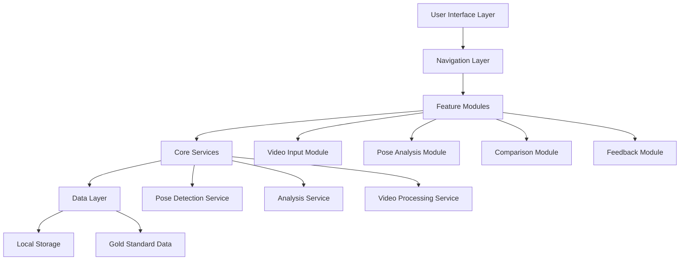

# Design Document: Pose Analysis Feedback System

## Overview

The Pose Analysis Feedback System is a React Native mobile application that enables users to analyze their ultimate frisbee throwing form through video analysis. The system leverages Google MediaPipe's BlazePose model for pose estimation, compares detected poses against gold standard data, and provides actionable feedback through both textual recommendations and side-by-side video comparison.

### Key Technologies

- **React Native** with Expo framework
- **Expo Router** for file-based navigation
- **NativeWind** + **Gluestack UI** for styling
- **React Native Vision Camera** for video capture
- **MediaPipe Tasks Vision** (@mediapipe/tasks-vision) for pose detection
- **Expo Video** for video playback
- **Expo Media Library** for media access
- **React Native Reanimated** for animations
- **MMKV** for local data persistence

## Architecture

### High-Level Architecture



### Module Breakdown

1. **Video Input Module**: Handles video recording and selection
2. **Pose Analysis Module**: Processes videos through BlazePose
3. **Comparison Module**: Compares user poses against gold standard
4. **Feedback Module**: Generates and displays recommendations
5. **Core Services**: Reusable business logic
6. **Data Layer**: Persistence and data management

## Components and Interfaces

### 1. Navigation Structure (Expo Router)

```
app/
├── _layout.tsx                    # Root layout with providers
├── (tabs)/
│   ├── _layout.tsx               # Tab navigator
│   ├── index.tsx                 # Home/Camera tab
│   └── history.tsx               # Analysis history tab
├── analysis/
│   ├── _layout.tsx               # Analysis flow layout
│   ├── input-selection.tsx       # Choose record/select video
│   ├── processing.tsx            # Pose detection progress
│   └── results.tsx               # Analysis results & feedback
└── comparison/
    └── [id].tsx                  # Side-by-side video viewer
```

### 2. Core Components

#### VideoInputSelector Component
```typescript
interface VideoInputSelectorProps {
  onVideoSelected: (videoUri: string) => void;
  onRecordPressed: () => void;
}

// Displays two options: Record New or Select Existing
// Uses Gluestack UI Button components
// Styled with NativeWind classes
```

#### PoseDetectionProcessor Component
```typescript
interface PoseDetectionProcessorProps {
  videoUri: string;
  onComplete: (landmarks: PoseLandmarkData[]) => void;
  onError: (error: Error) => void;
}

interface PoseLandmarkData {
  frameIndex: number;
  timestamp: number;
  landmarks: NormalizedLandmark[];
  worldLandmarks: Landmark[];
}

interface NormalizedLandmark {
  x: number;        // 0-1 normalized
  y: number;        // 0-1 normalized
  z: number;        // depth
  visibility?: number;
}
```

#### ComparisonViewer Component
```typescript
interface ComparisonViewerProps {
  userVideoUri: string;
  goldStandardVideoUri: string;
  userLandmarks: PoseLandmarkData[];
  goldStandardLandmarks: PoseLandmarkData[];
  highlightedSegments?: BodySegment[];
}

type BodySegment = 
  | 'shoulder' 
  | 'elbow' 
  | 'wrist' 
  | 'hip' 
  | 'knee' 
  | 'ankle';
```

#### FeedbackDisplay Component
```typescript
interface FeedbackDisplayProps {
  analysisReport: AnalysisReport;
  onSegmentPress: (segment: BodySegment) => void;
}

interface AnalysisReport {
  overallScore: number;          // 0-100
  categories: FeedbackCategory[];
  timestamp: Date;
  videoUri: string;
}

interface FeedbackCategory {
  name: string;                  // "Upper Body", "Lower Body", etc.
  issues: FeedbackIssue[];
}

interface FeedbackIssue {
  segment: BodySegment;
  severity: 'high' | 'medium' | 'low';
  deviationDegrees: number;
  description: string;
  recommendation: string;
}
```

### 3. Service Layer

#### PoseDetectionService
```typescript
class PoseDetectionService {
  private poseLandmarker: PoseLandmarker | null = null;
  
  async initialize(): Promise<void>;
  async detectPosesInVideo(
    videoUri: string,
    onProgress: (progress: number) => void
  ): Promise<PoseLandmarkData[]>;
  async detectPoseInFrame(
    imageData: ImageData
  ): Promise<NormalizedLandmark[]>;
  dispose(): void;
}
```

**Implementation Notes:**
- Uses @mediapipe/tasks-vision for web/React Native
- Loads BlazePose model from CDN or bundled asset
- Extracts video frames at 10-15 FPS for processing
- Returns normalized landmarks (0-1 coordinates)

#### VideoProcessingService
```typescript
class VideoProcessingService {
  async extractFrames(
    videoUri: string,
    fps: number
  ): Promise<VideoFrame[]>;
  async getVideoDuration(videoUri: string): Promise<number>;
  async validateVideo(videoUri: string): Promise<ValidationResult>;
}

interface VideoFrame {
  index: number;
  timestamp: number;
  imageData: ImageData;
}

interface ValidationResult {
  isValid: boolean;
  duration?: number;
  error?: string;
}
```

#### AnalysisService
```typescript
class AnalysisService {
  async compareP oses(
    userLandmarks: PoseLandmarkData[],
    goldStandardLandmarks: PoseLandmarkData[]
  ): Promise<ComparisonResult>;
  
  async generateFeedback(
    comparison: ComparisonResult
  ): Promise<AnalysisReport>;
  
  private calculateJointAngles(
    landmarks: NormalizedLandmark[]
  ): JointAngles;
  
  private calculateDeviations(
    userAngles: JointAngles,
    goldAngles: JointAngles
  ): DeviationScores;
}

interface JointAngles {
  shoulder: { left: number; right: number };
  elbow: { left: number; right: number };
  wrist: { left: number; right: number };
  hip: { left: number; right: number };
  knee: { left: number; right: number };
}

interface DeviationScores {
  [segment: string]: {
    deviation: number;
    severity: 'high' | 'medium' | 'low';
  };
}

interface ComparisonResult {
  deviations: DeviationScores;
  overallScore: number;
  keyFrames: number[];  // Frame indices with significant deviations
}
```

#### StorageService
```typescript
class StorageService {
  async saveAnalysis(report: AnalysisReport): Promise<string>;
  async getAnalysisHistory(): Promise<AnalysisReport[]>;
  async getAnalysisById(id: string): Promise<AnalysisReport | null>;
  async deleteAnalysis(id: string): Promise<void>;
  async getGoldStandardData(): Promise<GoldStandardData>;
}

interface GoldStandardData {
  videoUri: string;
  landmarks: PoseLandmarkData[];
  metadata: {
    description: string;
    athleteName: string;
    recordedDate: Date;
  };
}
```

## Data Models

### Pose Landmark Indices (BlazePose)
```typescript
enum PoseLandmarkIndex {
  NOSE = 0,
  LEFT_EYE_INNER = 1,
  LEFT_EYE = 2,
  LEFT_EYE_OUTER = 3,
  RIGHT_EYE_INNER = 4,
  RIGHT_EYE = 5,
  RIGHT_EYE_OUTER = 6,
  LEFT_EAR = 7,
  RIGHT_EAR = 8,
  MOUTH_LEFT = 9,
  MOUTH_RIGHT = 10,
  LEFT_SHOULDER = 11,
  RIGHT_SHOULDER = 12,
  LEFT_ELBOW = 13,
  RIGHT_ELBOW = 14,
  LEFT_WRIST = 15,
  RIGHT_WRIST = 16,
  LEFT_PINKY = 17,
  RIGHT_PINKY = 18,
  LEFT_INDEX = 19,
  RIGHT_INDEX = 20,
  LEFT_THUMB = 21,
  RIGHT_THUMB = 22,
  LEFT_HIP = 23,
  RIGHT_HIP = 24,
  LEFT_KNEE = 25,
  RIGHT_KNEE = 26,
  LEFT_ANKLE = 27,
  RIGHT_ANKLE = 28,
  LEFT_HEEL = 29,
  RIGHT_HEEL = 30,
  LEFT_FOOT_INDEX = 31,
  RIGHT_FOOT_INDEX = 32
}
```

### Storage Schema (MMKV)
```typescript
// Keys
const STORAGE_KEYS = {
  ANALYSIS_HISTORY: 'analysis_history',
  GOLD_STANDARD: 'gold_standard_data',
  USER_PREFERENCES: 'user_preferences',
};

// Stored as JSON strings
interface StoredAnalysis {
  id: string;
  timestamp: number;
  videoUri: string;
  report: AnalysisReport;
  thumbnailUri?: string;
}
```

## Error Handling

### Error Types
```typescript
enum AnalysisErrorType {
  VIDEO_LOAD_FAILED = 'VIDEO_LOAD_FAILED',
  VIDEO_TOO_LONG = 'VIDEO_TOO_LONG',
  POSE_DETECTION_FAILED = 'POSE_DETECTION_FAILED',
  NO_PERSON_DETECTED = 'NO_PERSON_DETECTED',
  INSUFFICIENT_STORAGE = 'INSUFFICIENT_STORAGE',
  NETWORK_ERROR = 'NETWORK_ERROR',
  MODEL_LOAD_FAILED = 'MODEL_LOAD_FAILED',
}

class AnalysisError extends Error {
  constructor(
    public type: AnalysisErrorType,
    message: string,
    public recoverable: boolean = true
  ) {
    super(message);
  }
}
```

### Error Handling Strategy
1. **Video Validation Errors**: Show user-friendly message with retry option
2. **Pose Detection Failures**: Continue processing remaining frames, warn if < 50% success rate
3. **Storage Errors**: Prompt user to free space or skip saving
4. **Network Errors**: Offer offline mode with cached model
5. **Model Load Errors**: Show error with troubleshooting steps

## Testing Strategy

### Unit Tests
- **Services**: Test pose detection, angle calculation, deviation scoring
- **Utilities**: Test frame extraction, video validation, data transformation
- **Storage**: Test CRUD operations for analysis history

### Integration Tests
- **Video Processing Pipeline**: Record → Extract → Detect → Analyze
- **Navigation Flow**: Input selection → Processing → Results
- **Data Persistence**: Save analysis → Retrieve → Display

### Component Tests
- **VideoInputSelector**: Button interactions, navigation
- **ComparisonViewer**: Video synchronization, landmark overlay
- **FeedbackDisplay**: Issue rendering, segment highlighting

### E2E Tests (Optional)
- Complete analysis flow from video selection to feedback display
- Side-by-side comparison with interaction
- Analysis history management

## Performance Considerations

### Optimization Strategies

1. **Frame Extraction**
   - Extract at 10-15 FPS (not full 30/60 FPS)
   - Use lower resolution for processing (640x480)
   - Process frames in batches to avoid memory spikes

2. **Pose Detection**
   - Use BlazePose Lite model for faster processing
   - Implement frame skipping for very long videos
   - Show progress indicator with estimated time

3. **Video Playback**
   - Preload both videos before comparison view
   - Use hardware acceleration for decoding
   - Implement efficient landmark overlay rendering

4. **Data Storage**
   - Store only essential landmark data (not full frames)
   - Compress analysis reports before saving
   - Implement pagination for history list

5. **Memory Management**
   - Dispose pose detector when not in use
   - Clear frame buffers after processing
   - Use React.memo for expensive components

## UI/UX Design Patterns

### Styling Approach
- **NativeWind**: Primary styling with Tailwind classes
- **Gluestack UI**: Pre-built components (Button, Card, Progress, Modal)
- **Custom Colors**: Use tailwind.config.js color system
- **Responsive**: Support both portrait and landscape orientations

### Key Screens

#### 1. Input Selection Screen
- Large, prominent buttons for "Record New" and "Select Video"
- Recent analysis history preview
- Quick access to gold standard video info

#### 2. Processing Screen
- Circular progress indicator
- Current frame / total frames counter
- Estimated time remaining
- Cancel button

#### 3. Results Screen
- Overall score prominently displayed (0-100)
- Categorized feedback list (Upper Body, Lower Body, Overall)
- Each issue shows severity badge, description, recommendation
- "View Comparison" button
- "Save Analysis" and "Share" options

#### 4. Comparison Viewer
- Split-screen video players (user left, gold standard right)
- Synchronized playback controls
- Pose landmark overlays on both videos
- Highlighted segments based on selected feedback issue
- Scrubber for frame-by-frame analysis

## Implementation Phases

### Phase 1: Foundation (Core Infrastructure)
- Set up Expo Router navigation structure
- Implement video input selection
- Integrate React Native Vision Camera
- Create basic UI components with Gluestack

### Phase 2: Pose Detection
- Integrate MediaPipe BlazePose
- Implement frame extraction service
- Build pose detection pipeline
- Add progress tracking

### Phase 3: Analysis Engine
- Implement angle calculation algorithms
- Build comparison logic
- Create feedback generation system
- Add gold standard data placeholder

### Phase 4: Comparison Viewer
- Build side-by-side video player
- Implement landmark overlay rendering
- Add synchronization logic
- Create interactive segment highlighting

### Phase 5: Polish & Optimization
- Add error handling and validation
- Implement data persistence
- Optimize performance
- Add animations and transitions
- Conduct testing

## Dependencies

### Required Packages
```json
{
  "@mediapipe/tasks-vision": "^0.10.0",
  "expo-image-picker": "~15.0.0",
  "expo-file-system": "~18.0.0",
  "expo-av": "~15.0.0"
}
```

### Native Permissions
- Camera (already configured)
- Media Library (already configured)
- Storage access

## Future Enhancements

1. **Cloud Sync**: Backup analysis history to cloud
2. **Multiple Gold Standards**: Different throwing styles
3. **Real-time Analysis**: Live camera feed analysis
4. **Social Features**: Share analyses with coaches
5. **Advanced Metrics**: Velocity, acceleration, trajectory
6. **AR Overlay**: Real-time pose correction guidance
7. **Export Options**: PDF reports, video exports with overlays
